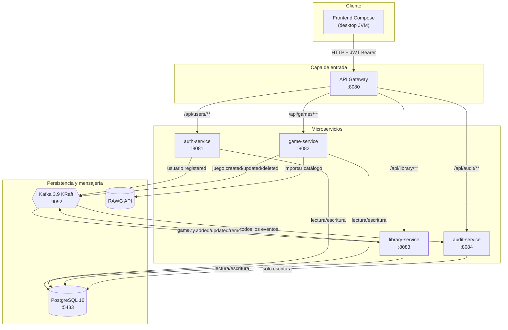
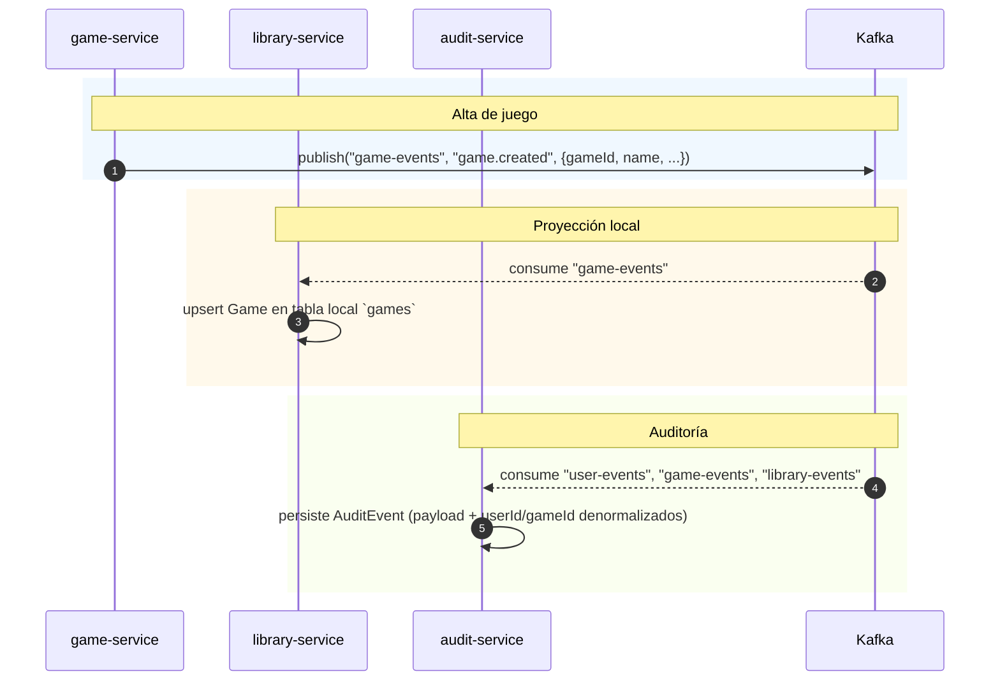
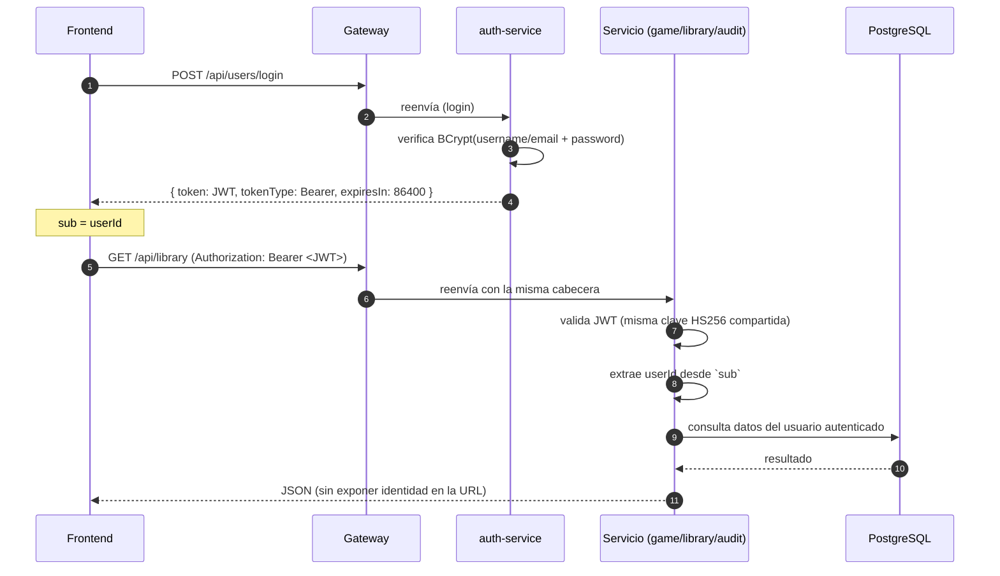

# 📐 Arquitectura

## 1. Diagrama de componentes



## 2. Flujo de eventos



## 3. Secuencia JWT (autenticación)



## 4. Formato de eventos (`EventEnvelope`)

Todos los eventos usan la misma envoltura (`shared/event/EventEnvelope.kt`):

```json
{
  "type": "game.created",
  "occurredAt": "2026-09-15T10:00:00Z",
  "payload": { "gameId": 42, "name": "Celeste", "genre": "Platformer" }
}
```

### Payloads por dominio

| Evento | Payload |
|--------|---------|
| `user.registered` | `{ userId, username }` |
| `user.deactivated` | `{ userId, username }` |
| `game.created` · `game.updated` | `{ gameId, name, description?, genre?, releaseDate?, developer?, publisher?, cover?, createdAt }` |
| `game.deleted` | `{ gameId, name }` |
| `library.added` · `library.updated` | `{ userId, gameId, isFavorite, hoursPlayed }` |
| `library.removed` | `{ userId, gameId }` |

## 5. Puertos y rutas

| Componente | Puerto | Rutas |
|------------|--------|-------|
| api-gateway | 8080 | `/api/users/**`, `/api/games/**`, `/api/library/**`, `/api/audit/**` |
| auth-service | 8081 | `/api/users/**` |
| game-service | 8082 | `/api/games/**` |
| library-service | 8083 | `/api/library/**` |
| audit-service | 8084 | `/api/audit/**` |
| PostgreSQL | 5433 | — |
| Kafka | 9092 | `user-events`, `game-events`, `library-events` |

## 6. Base de datos

Una sola instancia PostgreSQL para desarrollo con **una base por servicio** (aislamiento como en producción, mismo servidor):

```
postgres:5433
├── authdb     ← tablas de usuarios (U único por username/email)
├── gamedb     ← juegos del catálogo
├── librarydb  ← games (proyección) + library_entries
└── auditdb    ← audit_events
```

- Cada base tiene sus propias migraciones **Flyway** con `ddl-auto: validate` (valida que las entidades JPA cuadran con el esquema, nunca lo modifica).
- `librarydb.library_entries.game_id` → FK → `librarydb.games(id)` con **`ON DELETE CASCADE`**: borrar un juego desde game-service (vía evento `game.deleted`) limpia automáticamente las entradas de biblioteca.

## 7. Seguridad

- **auth-service** (único emisor): bcrypt para contraseñas, emite JWT HS256 con `sub` = userId.
- **Gateway**: reenvía sin modificar las cabeceras; no valida JWT (los servicios lo hacen).
- **Servicios**: cada uno valida el JWT con el **mismo secreto** (`app.jwt.secret`) vía `JwtSecurityConfig` compartido.
- **Endpoints públicos:**
  - `POST /api/users` (registro)
  - `POST /api/users/login` (login → JWT)
  - `GET /api/games/**` (catálogo abierto)
  - `/actuator/**` (health/info)
- El resto requiere `Authorization: Bearer <JWT>`.