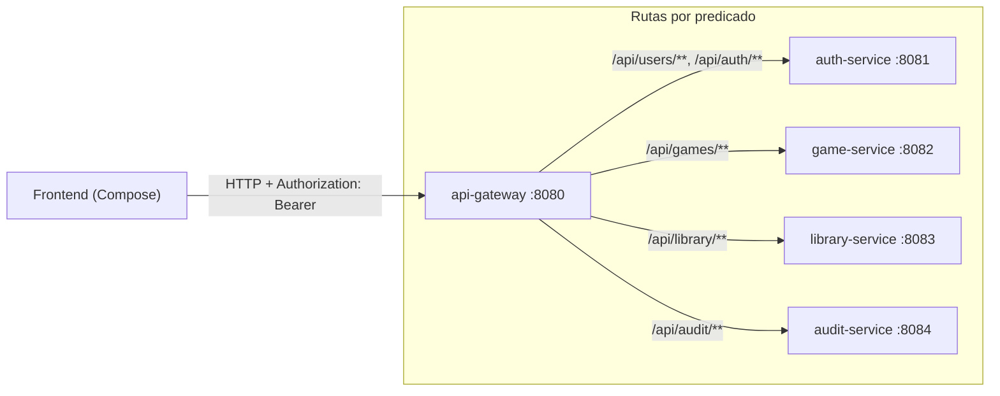

# 🚪 api-gateway

**Punto de entrada único** del backend. Es un **Spring Cloud Gateway** (reactivo, basado en WebFlux) que enruta las peticiones del frontend hacia los microservicios según el prefijo de la ruta.

- **Puerto:** `8080`
- **Tests:** — (sin lógica propia todavía)

## Responsabilidades

1. **Enrutamiento** de cada prefijo `/api/*` hacia el servicio correspondiente
2. **Un único host** para el frontend: Compose solo habla con `http://localhost:8080`
3. **Reenvío transparente** de cabeceras HTTP, incluido `Authorization`, hacia los servicios de destino

## Diagrama de enrutamiento



## Rutas configuradas (`application.yml`)

```yaml
spring:
  cloud:
    gateway:
      routes:
        - id: auth-service
          uri: http://localhost:8081
          predicates:
            - Path=/api/auth/**,/api/users/**
        - id: game-service
          uri: http://localhost:8082
          predicates:
            - Path=/api/games/**
        - id: library-service
          uri: http://localhost:8083
          predicates:
            - Path=/api/library/**
        - id: audit-service
          uri: http://localhost:8084
          predicates:
            - Path=/api/audit/**
```

| Ruta | Destino | Backend |
|------|---------|---------|
| `/api/users/**`, `/api/auth/**` | `:8081` | auth-service |
| `/api/games/**` | `:8082` | game-service |
| `/api/library/**` | `:8083` | library-service |
| `/api/audit/**` | `:8084` | audit-service |

## Seguridad (estado actual)

> ⚠️ **Estado: gateway pasarela.** Hoy el gateway **reenvía sin modificar**; no valida JWT (la validación la hace cada servicio de destino). Esto colapsa el *single responsibility* del edge y es el objetivo del siguiente hito (P2).

**Planificado (no implementado):**
- Filtro global de JWT en el gateway para las rutas protegidas (evita llegar a servicios con tokens inválidos).
- Resilience4j (circuit breaker) para no propagar caídas de un servicio.
- OpenAPI aggregado (un solo swagger que documente todos los servicios).

## Estructura de paquetes

```
com.marcmarco.gateway
├── GatewayApplication.kt
└── (resources)
    └── application.yml   ← definición de rutas
```

## Configuración relevante (`application.yml`)

| Propiedad | Valor | Descripción |
|-----------|-------|-------------|
| `server.port` | `8080` | Puerto del edge (el frontend apunta aquí) |
| `spring.cloud.gateway.routes` | tabla anterior | Enrutamiento por predicado de Path |

## Notas de despliegue

- En desarrollo los `uri` apuntan a `localhost:<puerto>` de cada servicio.
- En un despliegue real (p. ej. Railway), los `uri` se resuelven con la **misma variable de entorno** del servicio destino (el nombre del servicio en la red interna en vez de `localhost`), reutilizando la config por servicio en vez de duplicar YAML.