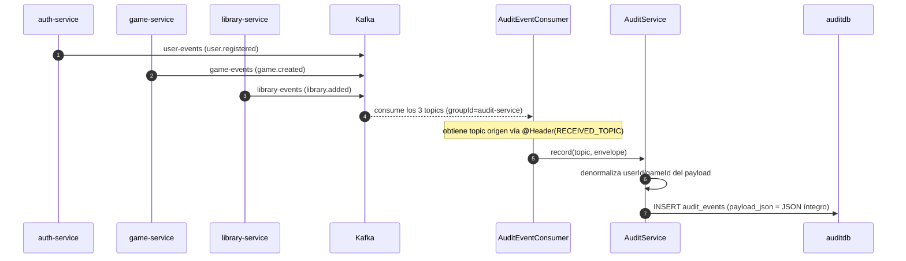

# 🧾 audit-service

Servicio de **registro de eventos de dominio** (auditoría). Consume **todos** los topics de Kafka (`user-events`, `game-events`, `library-events`) y persiste cada evento como un registro inmutable en `auditdb` con el payload JSON íntegro.

- **Puerto:** `8084`
- **Base de datos:** `auditdb` (PostgreSQL)
- **Tests:** 21

## Responsabilidades

1. **Absorber** todos los eventos de dominio de los 3 topics de Kafka (un solo listener, `groupId="audit-service"`)
2. **Persistir** cada evento con `topic`, `type`, `userId`/`gameId` denormalizados (para búsquedas) y el `payload` completo en JSON
3. **Consultar** el registro con filtros combinables (`topic`, `type`, `userId`, `gameId`, `limit`) y por id

## Diagrama de flujo



## Modelo de datos (`auditdb`)

```sql
CREATE TABLE audit_events (
    id           BIGINT GENERATED BY DEFAULT AS IDENTITY PRIMARY KEY,
    topic        VARCHAR(50)  NOT NULL,
    event_type   VARCHAR(100) NOT NULL,
    user_id      BIGINT,
    game_id      BIGINT,
    payload_json TEXT         NOT NULL,
    occurred_at  TIMESTAMP WITH TIME ZONE NOT NULL
);

CREATE INDEX idx_audit_topic_type ON audit_events (topic, event_type);
CREATE INDEX idx_audit_occurred   ON audit_events (occurred_at DESC);
CREATE INDEX idx_audit_user       ON audit_events (user_id);
CREATE INDEX idx_audit_game       ON audit_events (game_id);
```

- Migración Flyway: `V1__create_audit_events.sql`.
- **Solo escritura desde Kafka**: no hay flujo de lectura en tiempo real; el servicio solo expone consultas (API de solo lectura).
- `payload_json` conserva el contenido íntegro del evento original; `user_id`/`game_id` se denormalizan en columnas propias para filtrar sin parsear JSON.

## API

**Todos los endpoints requieren autenticación** (`Authorization: Bearer <JWT>`). Son de **solo lectura**.

| Método | Ruta | Descripción |
|--------|------|-------------|
| `GET` | `/api/audit` | Búsqueda de eventos con filtros |
| `GET` | `/api/audit/{id}` | Detalle de un evento por id |

**Parámetros de `GET /api/audit`** (todos opcionales y combinables):

| Parámetro | Tipo | Descripción |
|-----------|------|-------------|
| `topic` | string | `user-events`, `game-events` o `library-events` |
| `type` | string | Tipo exacto, p. ej. `game.created` |
| `userId` | long | Filtrar por usuario |
| `gameId` | long | Filtrar por juego |
| `limit` | int | Máximo de resultados, 1–1000 (default `100`) |

### Ejemplo

`GET /api/audit?topic=game-events&type=game.created&gameId=42`

```json
[
  {
    "id": 12,
    "topic": "game-events",
    "type": "game.created",
    "userId": null,
    "gameId": 42,
    "payload": {
      "gameId": 42,
      "name": "Celeste",
      "description": "Ayuda a Madeline a escalar la montaña.",
      "genre": "Platformer",
      "createdAt": "2026-09-15T10:00:00Z"
    },
    "occurredAt": "2026-09-15T10:00:01Z"
  }
]
```

## Seguridad

`config/SecurityConfig.kt`: toda la API requiere JWT valido (solo `/actuator/**` queda abierto). El registro de auditoría es confidencial: no se expone públicamente.

## Consumidor Kafka: `AuditEventConsumer`

- **Topics:** `user-events`, `game-events`, `library-events`
- **GroupId:** `audit-service`
- **Condición:** `app.events.enabled=true`
- Recibe el topic de origen con `@Header(KafkaHeaders.RECEIVED_TOPIC)`: un único `@KafkaListener` sobre los tres topics en vez de tres listeners duplicados.

## Estructura de paquetes

```
com.marcmarco.audit
├── AuditApplication.kt
├── config/SecurityConfig.kt
├── dto/
│   └── AuditResponse.kt       ← rehidrata payload desde payload_json (ObjectMapper)
├── event/
│   └── AuditEventConsumer.kt  ← consume los 3 topics y delega en AuditService
├── AuditController.kt         ← REST API de solo lectura
├── AuditService.kt            ← record() + búsquedas filtradas + get by id
├── AuditEventRepository.kt    ← Spring Data JPA
└── AuditEvent.kt              ← entidad JPA
```

## Configuración relevante (`application.yml`)

| Variable | Default | Uso |
|----------|---------|-----|
| `AUDIT_DB_URL` | `jdbc:postgresql://localhost:5433/auditdb` | Datasource |
| `AUDIT_DB_USERNAME` / `AUDIT_DB_PASSWORD` | `postgres` | Credenciales BD |
| `JWT_SECRET` | `dev-only-jwt-secret-cambiar-antes-de-produccion` | Clave HS256 |
| `KAFKA_BOOTSTRAP` | `localhost:9092` | Broker |
| `EVENTS_ENABLED` | `true` | Activa el consumidor Kafka |