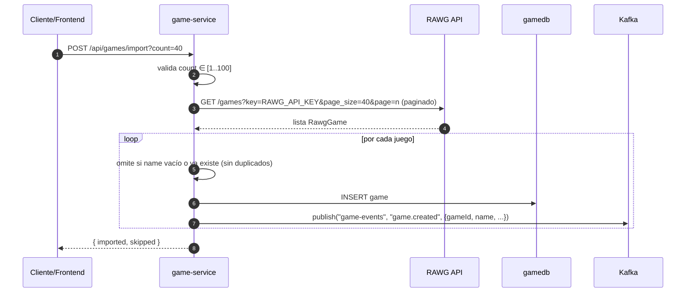

# 🎮 game-service

Servicio del **catálogo de juegos**. Expone CRUD de juegos y la **importación del catálogo desde la API de RAWG**. Es el fuente de verdad del catálogo y publica los eventos `game.created` / `game.updated` / `game.deleted`.

- **Puerto:** `8082`
- **Base de datos:** `gamedb` (PostgreSQL)
- **Tests:** 16

## Responsabilidades

1. **CRUD** de juegos (crear, consultar, actualizar, borrar)
2. **Búsqueda** con filtros combinables (nombre, género, desarrollador, publicador, rango de fechas)
3. **Importación** masiva desde RAWG (`POST /api/games/import`) paginada
4. **Publicación** de eventos de catálogo en el topic `game-events`

## Diagrama de flujo (importación RAWG)



## Modelo de datos (`gamedb`)

```sql
CREATE TABLE games (
    id           BIGINT GENERATED BY DEFAULT AS IDENTITY PRIMARY KEY,
    name         VARCHAR(200) NOT NULL,
    description  VARCHAR(5000),
    genre        VARCHAR(100),
    release_date DATE,
    developer    VARCHAR(200),
    publisher    VARCHAR(200),
    cover        VARCHAR(500),
    created_at   TIMESTAMP WITH TIME ZONE NOT NULL DEFAULT NOW(),
    CONSTRAINT uk_games_name UNIQUE (name)
);
```

- Migración Flyway: `V1__create_games.sql`.
- `name` es único: evita duplicados tanto en alta manual como en la importación de RAWG (comprobación *case-insensitive* en el importador).

## API

### Públicas (no requieren token)

| Método | Ruta | Descripción |
|--------|------|-------------|
| `GET` | `/api/games` | Búsqueda con filtros opcionales |
| `GET` | `/api/games/{id}` | Detalle de un juego |

**Parámetros de `GET /api/games`** (todos opcionales y combinables): `name`, `genre`, `developer`, `publisher`, `releaseDateFrom`, `releaseDateTo` (formato `ISO-8601`, `yyyy-MM-dd`).

### Autenticadas (requieren `Authorization: Bearer <JWT>`)

| Método | Ruta | Descripción |
|--------|------|-------------|
| `POST` | `/api/games` | Crear juego |
| `POST` | `/api/games/import?count=40` | Importar de RAWG (`count` entre 1 y 100, default 40) |
| `PUT` | `/api/games/{id}` | Actualizar juego |
| `DELETE` | `/api/games/{id}` | Borrar juego → emite `game.deleted` |

### Ejemplos

**Crear juego** `POST /api/games`

```json
{
  "name": "Celeste",
  "description": "Ayuda a Madeline a escalar la montaña.",
  "genre": "Platformer",
  "releaseDate": "2018-01-25",
  "developer": "Maddy Makes Games",
  "publisher": "Maddy Makes Games",
  "cover": "https://media.rawg.io/media/covers/celeste.jpg"
}
```

**Importar** `POST /api/games/import?count=40` → `{ "imported": 38, "skipped": 2 }`

*(`skipped` cuenta juegos con nombre vacío o ya existentes en el catálogo.)*

## Integración con RAWG

- Cliente sin dependencias de infraestructura: `RestClient` de Spring con **paginación de 40 por página**; calcula las páginas necesarias a partir de `count` y hace `fetchGames` con `page_size=40`.
- Requiere `RAWG_API_KEY` (variable de entorno). Si está vacía, responde `400` con mensaje explícito.
- Mapeo (cliente → catálogo):
  - `RawgGame.name` → `name` (trim)
  - primer `genres[].name` → `genre`
  - `released` (ISO) → `releaseDate` (parseo defensivo con `runCatching`)
  - primer `developers[].name` → `developer`
  - primer `publishers[].name` → `publisher`
  - `background_image` → `cover`
- Errores de RAWG (status ≠ 2xx) se traducen a `BadRequestException` con el código HTTP de la API.

## Seguridad

`config/SecurityConfig.kt`: el **catálogo es de lectura pública** (`GET /api/games/**` y `/actuator/**` permitidos), mientras que creación, edición, borrado e importación requieren un JWT válido (validado con la clave compartida `app.jwt.secret`).

## Eventos publicados (topic `game-events`)

| Evento | Payload |
|--------|---------|
| `game.created` · `game.updated` | `{ gameId, name, description?, genre?, releaseDate?, developer?, publisher?, cover?, createdAt }` |
| `game.deleted` | `{ gameId, name }` |

Publicador: `GameEventPublisher` (condicionado a `app.events.enabled=true`). El payload se genera con `Game.toEventPayload()`.

## Estructura de paquetes

```
com.marcmarco.game
├── GameApplication.kt
├── config/SecurityConfig.kt
├── dto/                     ← GameRequest, GameResponse, ImportResponse
├── event/GameEventPublisher.kt
├── rawg/
│   ├── RawgDtos.kt          ← RawgListResponse, RawgGame, RawgNamedItem
│   └── RawgRestClient.kt    ← cliente HTTP paginado de RAWG
├── GameController.kt        ← REST API
├── GameService.kt           ← CRUD + búsqueda + publicación de eventos
├── GameImportService.kt     ← importación RAWG
├── GameRepository.kt        ← Spring Data JPA
└── Game.kt                  ← entidad JPA
```

## Configuración relevante (`application.yml`)

| Variable | Default | Uso |
|----------|---------|-----|
| `GAME_DB_URL` | `jdbc:postgresql://localhost:5433/gamedb` | Datasource |
| `GAME_DB_USERNAME` / `GAME_DB_PASSWORD` | `postgres` | Credenciales BD |
| `JWT_SECRET` | `dev-only-jwt-secret-cambiar-antes-de-produccion` | Clave HS256 |
| `RAWG_API_KEY` | *(vacía)* | API key de RAWG |
| `RAWG_BASE_URL` | `https://api.rawg.io/api` | Base URL de RAWG |
| `KAFKA_BOOTSTRAP` | `localhost:9092` | Broker |
| `EVENTS_ENABLED` | `true` | Activa el publicador Kafka |