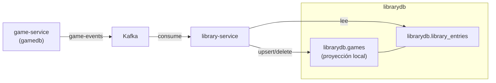

# 📚 library-service

Servicio de **biblioteca personal**. Cada usuario tiene su lista de juegos con metadatos (`isFavorite`, `hoursPlayed`) y sus **categorías personales** para organizar esa biblioteca. Mantiene una **proyección local del catálogo de juegos** sincronizada vía Kafka para poder resolver las respuestas con el juego anidado sin llamadas síncronas a game-service.

- **Puerto:** `8083`
- **Base de datos:** `librarydb` (PostgreSQL)
- **Tests:** 44

## Responsabilidades

1. **CRUD** de entradas de biblioteca (añadir, actualizar, eliminar juegos de la biblioteca de un usuario)
2. **Búsqueda** de la biblioteca del usuario con filtro por nombre y por favoritos
3. **Categorías personales**: CRUD de categorías por usuario y asignación/desasignación a entradas de su propia biblioteca
4. **Proyección local** de juegos: consume eventos `game.created`/`game.updated`/`game.deleted` y sincroniza la tabla local `games` (`GameProjectionService`)
5. **Publicación** de eventos `library.added`/`library.updated`/`library.removed` en el topic `library-events`

## Proyección local del catálogo (CQRS ligero)



- La tabla `games` de `librarydb` **no tiene autogeneración de ID**: usa el mismo `id` del juego en game-service (campo asignado).
- `library_entries.game_id` → FK → `games(id)` con **`ON DELETE CASCADE`**: borrar un juego vía evento `game.deleted` limpia automáticamente las entradas de biblioteca que lo referencian.
- `GameProjectionService` usa `EntityManager.persist()` para juegos nuevos (porque el ID es asignado, no secuencia) y `gameRepository.save()` para actualizaciones.
- Si la proyección está desactualizada, el evento la corrige con el próximo evento de tipo `CREATED`/`UPDATED`.

## Modelo de datos (`librarydb`)

```sql
-- V1: proyección del catálogo
CREATE TABLE games (
    id           BIGINT PRIMARY KEY,        -- mismo ID que en game-service
    name         VARCHAR(200) NOT NULL,
    description  VARCHAR(5000),
    genre        VARCHAR(100),
    release_date DATE,
    developer    VARCHAR(200),
    publisher    VARCHAR(200),
    cover        VARCHAR(500),
    created_at   TIMESTAMP WITH TIME ZONE NOT NULL DEFAULT NOW()
);

-- V2: entradas de biblioteca
CREATE TABLE library_entries (
    id           BIGINT GENERATED BY DEFAULT AS IDENTITY PRIMARY KEY,
    user_id      BIGINT NOT NULL,
    game_id      BIGINT NOT NULL,
    is_favorite  BOOLEAN NOT NULL DEFAULT FALSE,
    hours_played DOUBLE PRECISION NOT NULL DEFAULT 0,
    added_at     TIMESTAMP WITH TIME ZONE NOT NULL DEFAULT NOW(),
    CONSTRAINT uk_library_user_game UNIQUE (user_id, game_id),
    CONSTRAINT fk_library_game FOREIGN KEY (game_id)
        REFERENCES games (id) ON DELETE CASCADE
);

-- V4: categorías personales por usuario
CREATE TABLE library_categories (
    id         BIGINT GENERATED BY DEFAULT AS IDENTITY PRIMARY KEY,
    user_id    BIGINT NOT NULL,
    name       VARCHAR(100) NOT NULL,
    created_at TIMESTAMP WITH TIME ZONE NOT NULL DEFAULT NOW(),
    CONSTRAINT uk_category_user_name UNIQUE (user_id, name)
);

CREATE TABLE library_entry_categories (
    library_entry_id BIGINT NOT NULL,
    category_id      BIGINT NOT NULL,
    PRIMARY KEY (library_entry_id, category_id),
    CONSTRAINT fk_lec_entry FOREIGN KEY (library_entry_id)
        REFERENCES library_entries (id) ON DELETE CASCADE,
    CONSTRAINT fk_lec_category FOREIGN KEY (category_id)
        REFERENCES library_categories (id) ON DELETE CASCADE
);
```

- **Constraints:**
  - `uk_library_user_game`: un usuario solo puede tener una entrada por juego.
  - `fk_library_game` + `ON DELETE CASCADE`: cascade real; el `ON DELETE` se ejecuta en DB sin intervenir JPA.
  - `uk_category_user_name`: una categoría es única por usuario. El nombre se busca **case-insensitive**, así que "Terror" y "terror" colisionan (se devuelve `409`).
  - `library_entry_categories`: puente many-to-many. Borrar una entrada o una categoría limpia automáticamente las asignaciones vía `ON DELETE CASCADE`.
  - Las categorías **no son globales**: no existen categorías de sistema, cada usuario solo ve y usa las suyas.

## API

**Todos los endpoints requieren autenticación** (`Authorization: Bearer <JWT>`).

| Método | Ruta | Descripción |
|--------|------|-------------|
| `POST` | `/api/library` | Añadir juego a la biblioteca |
| `GET` | `/api/library` | Listar biblioteca del usuario autenticado |
| `GET` | `/api/library/{gameId}` | Obtener entrada de la biblioteca |
| `PUT` | `/api/library/{gameId}` | Actualizar favorito / horas jugadas |
| `DELETE` | `/api/library/{gameId}` | Eliminar juego de la biblioteca |
| `POST` | `/api/categories` | Crear categoría personal |
| `GET` | `/api/categories` | Listar categorías del usuario (con `gameCount`) |
| `PUT` | `/api/categories/{categoryId}` | Renombrar categoría |
| `DELETE` | `/api/categories/{categoryId}` | Borrar categoría (limpia asignaciones) |
| `POST` | `/api/categories/{categoryId}/library/{gameId}` | Asignar categoría a un juego de la biblioteca |
| `DELETE` | `/api/categories/{categoryId}/library/{gameId}` | Desasignar categoría de un juego |

**Parámetros de `GET /api/library`:**
- `name` (opcional): filtro por nombre del juego (case-insensitive, parcial).
- `favorites` (default `false`): si es `true`, solo devuelve favoritos.

### Ejemplos

**Añadir juego** `POST /api/library`

```json
{ "gameId": 42, "isFavorite": true, "hoursPlayed": 23.5 }
```

**Respuesta:**

```json
{
  "userId": 7,
  "gameId": 42,
  "game": {
    "id": 42,
    "name": "Celeste",
    "description": "Ayuda a Madeline a escalar la montaña.",
    "genre": "Platformer",
    "releaseDate": "2018-01-25",
    "developer": "Maddy Makes Games",
    "publisher": "Maddy Makes Games",
    "cover": "https://...",
    "createdAt": "2026-09-15T10:00:00Z"
  },
  "isFavorite": true,
  "hoursPlayed": 23.5,
  "addedAt": "2026-09-15T10:15:00Z"
}
```

**Crear categoría** `POST /api/categories`

```json
{ "name": "Terror" }
```

**Respuesta:**

```json
{ "id": 1, "name": "Terror", "gameCount": 0 }
```

**Asignar categoría a un juego** `POST /api/categories/1/library/42` → devuelve la entrada de biblioteca con las categorías ya pobladas:

```json
{
  "userId": 7,
  "gameId": 42,
  "game": { "id": 42, "name": "Celeste" },
  "isFavorite": true,
  "hoursPlayed": 23.5,
  "addedAt": "2026-09-15T10:15:00Z",
  "categories": [
    { "id": 1, "name": "Terror", "gameCount": 1 }
  ]
}
```

**Listar categorías** `GET /api/categories` → cada una incluye cuántos juegos de la biblioteca la tienen asignada:

```json
[
  { "id": 1, "name": "Terror", "gameCount": 1 },
  { "id": 2, "name": "Todo",   "gameCount": 0 }
]
```

**Errores comunes (categorías):**
- `400` nombre vacío / sin cuerpo.
- `409` nombre duplicado (case-insensitive) al crear o renombrar.
- `404` categoría que no es del usuario, juego que no está en su biblioteca, o categoría no asignada al desasignar.
- `401` sin JWT (aplicable a toda la API).

## Seguridad

`config/SecurityConfig.kt`: **toda la API requiere JWT** (solo `/actuator/**` queda abierto).

El controlador extrae el `userId` del JWT validado usando la extensión `Jwt.userId()` (definida en `library/security/JwtUserId.kt`). El usuario **no se puede mover entre bibliotecas de otros usuarios**; el id viene del token y no es editable.

Las categorías son **estrictamente por usuario**: tanto el CRUD como las asignaciones resuelven siempre `categoría + entrada` filtrando por `userId`, por lo que un usuario jamás ve ni toca las categorías de otro (se devuelve `404`, no `403`, para no filtrar existencia).

## Consumidores y productores Kafka

### Consumidor: `GameEventConsumer`

- **Topic:** `game-events`
- **GroupId:** `library-service`
- **Condición:** `app.events.enabled=true`
- Delega a `GameProjectionService.handleGameEvent(type, payload)`
  - `game.created` / `game.updated` → upsert en la tabla local `games` (`EntityManager.persist()` o `save()`)
  - `game.deleted` → `gameRepository.findById().ifPresent { delete(it) }`

### Productor: `LibraryEventPublisher`

| Evento (topic `library-events`) | Payload |
|----------------------------------|---------|
| `library.added` · `library.updated` | `{ userId, gameId, isFavorite, hoursPlayed }` |
| `library.removed` | `{ userId, gameId }` |

Publicado tras cada operación de escritura (`add`, `update`, `remove`) dentro de la misma transacción que la persistencia.

## Estructura de paquetes

```
com.marcmarco.library
├── LibraryApplication.kt
├── config/SecurityConfig.kt
├── dto/
│   ├── LibraryAddRequest.kt       ← gameId, isFavorite?, hoursPlayed?
│   ├── LibraryUpdateRequest.kt    ← isFavorite?, hoursPlayed?
│   ├── LibraryResponse.kt         ← respuesta con game anidado (GameResponse) + categorías
│   ├── GameResponse.kt            ← DTO del juego proyectado
│   ├── CategoryRequest.kt         ← name
│   └── CategoryResponse.kt        ← id, name, gameCount
├── event/
│   ├── GameEventConsumer.kt       ← consume game-events
│   ├── GameProjectionService.kt   ← aplica eventos a la tabla local games
│   └── LibraryEventPublisher.kt   ← publica library-events
├── security/
│   └── JwtUserId.kt               ← Jwt.userId() extensión
├── LibraryController.kt           ← REST API (todos los endpoints autenticados)
├── LibraryService.kt              ← lógica de negocio + publicación de eventos
├── LibraryRepository.kt           ← Spring Data JPA
├── LibraryEntry.kt                ← entidad JPA (ManyToOne → Game, @ManyToMany → categorías)
├── LibraryCategoryController.kt   ← REST API de categorías (autenticada)
├── LibraryCategoryService.kt      ← CRUD + assign/unassign por userId
├── LibraryCategoryRepository.kt   ← Spring Data JPA (incl. countGamesByCategory)
├── LibraryCategory.kt             ← entidad JPA (unique user_id + name case-insensitive)
├── GameRepository.kt              ← Spring Data JPA (proyección)
└── Game.kt                        ← entidad de proyección (id asignado, no autogenerado)
```

## Configuración relevante (`application.yml`)

| Variable | Default | Uso |
|----------|---------|-----|
| `LIBRARY_DB_URL` | `jdbc:postgresql://localhost:5433/librarydb` | Datasource |
| `LIBRARY_DB_USERNAME` / `LIBRARY_DB_PASSWORD` | `postgres` | Credenciales BD |
| `JWT_SECRET` | `dev-only-jwt-secret-cambiar-antes-de-produccion` | Clave HS256 |
| `KAFKA_BOOTSTRAP` | `localhost:9092` | Broker |
| `EVENTS_ENABLED` | `true` | Activa consumidor + productor Kafka |